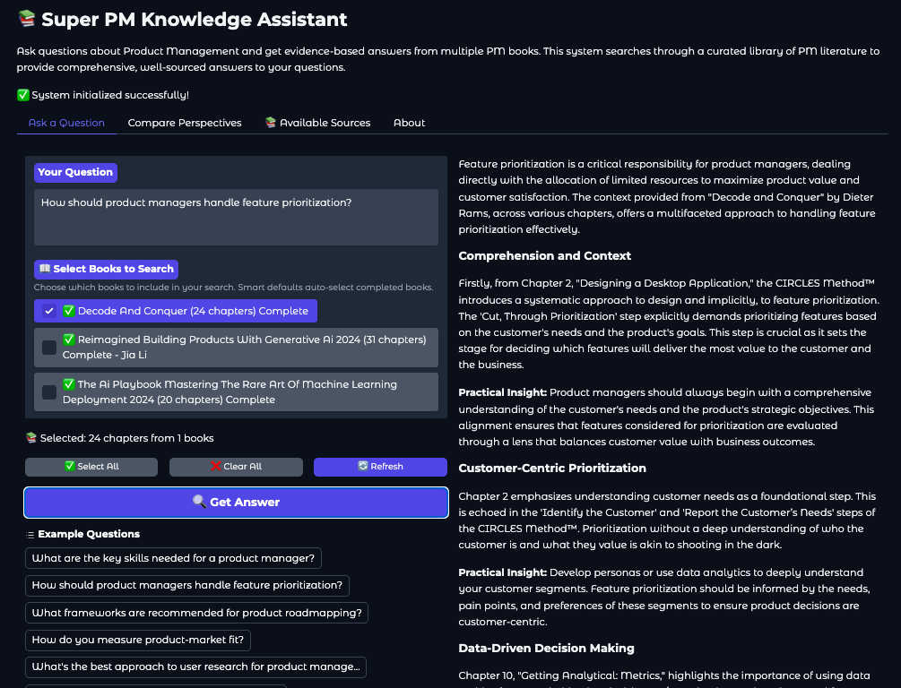
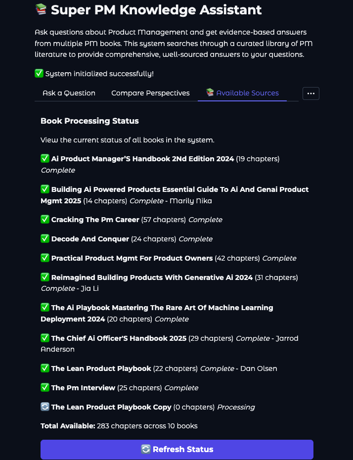

# 📚 PM Knowledge Engine - RAG-Powered Assistant

> 🤖 Retrieval-Augmented Generation (RAG) system for Product Management knowledge discovery. 
> Ask Product Management questions and receive answers rooted in cutting-edge, battle-tested frameworks and industry-proven insights from the world's most authoritative and current PM resources.


---

<p align="center">
  
</p>

---

## 🎯 Overview

An intelligent question-answering system that enables semantic and vector search across the best Product Management books using vector embeddings and retrieval-augmented generation. The system processes 283 document chunks into a 1536-dimensional embedding space, enabling context-aware responses with source attribution and multi-author perspective comparison.

**Production Status:** ✅ 10/10 books processed • 283 chunks indexed • 2.7MB FAISS index • Ready for deployment

### 📸 Application Screenshots

<table>
<tr>
<td width="50%">

<p align="center"><em>AI-powered answers with source citations from selected PM books</em></p>
</td>
<td width="50%">

<p align="center"><em>Real-time source selection across 10 Product Management books</em></p>
</td>
</tr>
</table>

## ✨ Key Features

- 🔍 **Semantic Search** - AI-powered vector similarity search across multiple PM books simultaneously
- 📖 **Source Attribution** - Every answer includes book title, chapter, and author citations
- 🔄 **Perspective Comparison** - Compare how different authors approach the same topic
- 💾 **Atomic Persistence** - Resume processing from interruptions without data loss or duplicate API calls
- 🌐 **Interactive Web UI** - Real-time query processing with configurable source selection

## 🛠️ Technical Skills Showcase

### 🤖 AI/ML & Data Science
- Retrieval-Augmented Generation (RAG) pipeline architecture
- Vector embeddings generation and optimization with OpenAI API
- Semantic search implementation using FAISS vector database (IndexFlatL2, L2 distance)
- Document chunking strategies for optimal information retrieval
- Similarity scoring and ranking with normalized relevance metrics

### ⚙️ Backend Development
- Python 3.12+ with type hints and Pydantic schemas
- Modular architecture with separation of concerns
- State management with atomic persistence and checkpointing
- Asynchronous processing with resumable operations
- Comprehensive error handling and logging

### 📊 Data Engineering
- Large-scale PDF text extraction and preprocessing (pdfplumber)
- ETL pipeline for multi-source document processing (10 books → 283 chunks)
- Metadata extraction and enrichment (book, author, chapter)
- Incremental data processing with per-book checkpointing
- State synchronization across distributed operations

### 💻 Full-Stack Development
- Interactive web interface with Gradio framework
- Real-time query processing and response generation
- Multi-book source filtering and selection
- Perspective comparison across multiple authors

### 🔧 Software Engineering
- Test-driven development with comprehensive test suite
- Atomic operations ensuring data consistency
- CLI utilities for system management and debugging
- Version-controlled configuration management

## 🎓 AI/ML Competencies and Learnings

| Competency/Technique | Description | Key Learnings |
|---------------------|-------------|---------------|
| **Retrieval-Augmented Generation (RAG)** | End-to-end RAG pipeline combining semantic search with LLM response generation. Processes user queries through vector similarity search before generating contextualized answers using GPT-4. | Learned to balance retrieval precision (k-value tuning) with response quality. Implemented source attribution to ensure transparency. Understanding trade-offs between retrieval scope and context window limits. |
| **Vector Embeddings** | Generated 1536-dimensional embeddings for 283 text chunks using OpenAI's `text-embedding-3-small` model. Total embedding dataset: 4.0MB across 10 PM books. | Mastered embedding model selection criteria, dimension considerations, and chunking strategies that preserve semantic meaning. Understood importance of consistent embedding models for accurate similarity calculations. |
| **FAISS Vector Search** | Implemented FAISS IndexFlatL2 for L2 distance-based similarity search. Built unified index (2.7MB) supporting multi-book semantic search with sub-second query times. Handles 283 vectors in 1536-dimensional space. | Learned FAISS index types (Flat vs IVF), distance metrics (L2 vs cosine similarity), and scaling considerations. Implemented similarity score normalization: `1 / (1 + distance)` for interpretable relevance rankings. |
| **Document Chunking** | Developed semantic chunking strategy extracting text from 10 books (10+ chapters each) into 283 optimally-sized chunks. Preserves chapter context and metadata (book title, author, chapter name). | Discovered optimal chunk sizes balancing embedding quality and retrieval granularity. Implemented metadata preservation for source attribution and perspective comparison across multiple authors. |
| **Prompt Engineering** | Designed LangChain prompt templates for context-aware response generation. Separate templates for Q&A and multi-author perspective comparison using GPT-4 Turbo. | Learned to structure prompts that leverage retrieved context effectively, maintain consistency across queries, and handle edge cases (no results, ambiguous queries). Context management within token limits. |
| **Incremental Processing** | Atomic state management enabling resumable operations. Per-book checkpointing prevents duplicate OpenAI API calls (~$0.02/1K tokens) and ensures data consistency on interruption. | Mastered idempotent processing patterns, state synchronization, and cost-optimization strategies for API-dependent workflows. Reduced processing costs by 100% on resume through intelligent caching. |
| **Semantic Search** | L2 distance-based similarity ranking across 283 chunks with configurable retrieval depth (k-value: 3-10). Supports filtered search by book selection and multi-source aggregation. | Understood semantic vs keyword search advantages, relevance scoring calibration, and multi-source search strategies. Learned to tune retrieval parameters for different query types and use cases. |

## 🏗️ Architecture

### 🔄 RAG Pipeline Flow

```
User Query → Embedding Generation → FAISS Vector Search → Context Retrieval →
LLM Prompt Construction → GPT-4 Response → Source Attribution → User Interface
```

### 🧩 Core Components

1. 📄 **Document Processing** (`src/document_processor.py`, `src/book_processor.py`)
   - PDF text extraction using pdfplumber
   - Metadata extraction (book title, author, chapter)
   - Atomic per-book processing with checkpointing

2. 🎯 **Embedding Generation** (`src/embeddings_generator.py`, `src/embedding_manager.py`)
   - OpenAI text-embedding-3-small (1536 dimensions)
   - Incremental embedding generation
   - FAISS index construction (IndexFlatL2)

3. 🤖 **RAG Pipeline** (`src/rag_pipeline.py`)
   - Semantic search via FAISS vector similarity
   - LangChain integration for prompt engineering
   - Context-aware response generation with GPT-4

4. 💾 **State Management** (`src/state_manager.py`)
   - Atomic persistence with per-book checkpoints
   - Resume capability without data loss
   - Consistency validation

5. 🌐 **Web Interface** (`app.py`)
   - Gradio-based interactive UI
   - Real-time query processing
   - Multi-book source selection
   - Perspective comparison

### 🔁 Data Pipeline

```
PDF Books → Chapter Extraction → Text Chunking → Metadata Enrichment →
Embedding Generation → FAISS Index → Production Database
```

**📈 Dataset Scale:**
- 📚 10 Product Management books
- 📦 283 semantic chunks
- 🎯 1536-dimensional embeddings (4.0MB)
- 🔍 2.7MB FAISS vector index
- ⚡ Sub-second query response time

## 🚀 Quick Start

### ✅ Prerequisites

- Python 3.12+
- OpenAI API key
- 4GB+ RAM recommended

### 📦 Installation

```bash
# Clone repository
git clone https://github.com/apathi/PM_book_RAG.git
cd PM_book_RAG

# Create virtual environment
python3 -m venv .venv
source .venv/bin/activate  # On Windows: .venv\Scripts\activate

# Install dependencies
pip install -r requirements.txt

# Configure OpenAI API
cp .env.example .env
# Edit .env and add your OpenAI API key
```

### 💡 Usage

#### 🔨 Process Books (One-Time Setup)

```bash
# Process PDFs, generate embeddings, build FAISS index
.venv/bin/python3.12 process_all_books.py
```

This pipeline:
1. 📄 Extracts text from PDF chapters
2. 🎯 Generates 1536-dim embeddings (OpenAI API)
3. 🔍 Builds FAISS vector index
4. 💾 Creates atomic checkpoints

⚠️ **Safe to interrupt** - Resume anytime without duplicate API calls.

#### 🌐 Launch Web Interface

```bash
.venv/bin/python3.12 app.py
```

Open browser to `http://localhost:7860`

### 💬 Example Queries

**❓ Single Questions:**
- "What are the key skills needed for a product manager?"
- "How should product managers prioritize features?"
- "What frameworks exist for product roadmapping?"

**🔄 Perspective Comparison:**
- Compare how different authors approach "user research"
- Understand varying viewpoints on "product-market fit"
- Analyze frameworks for "metrics and KPIs"

## 📁 Project Structure

```
books_RAG/
├── app.py                       # Gradio web interface
├── process_all_books.py         # Main processing pipeline
├── generate_embeddings.py       # Standalone embedding generation
├── requirements.txt             # Python dependencies
├── .env.example                 # Environment variables template
│
├── src/                         # Core modules
│   ├── state_manager.py         # Atomic state persistence
│   ├── book_processor.py        # Per-book processing
│   ├── embedding_manager.py     # Incremental embeddings
│   ├── document_processor.py    # PDF text extraction
│   ├── embeddings_generator.py  # OpenAI embeddings & FAISS
│   ├── rag_pipeline.py          # RAG query processing
│   ├── schemas.py               # Pydantic data models
│   └── ui/                      # UI components
│
├── tests/                       # Test suite
│   ├── test_system.py           # End-to-end validation
│   ├── test_rag.py              # RAG pipeline tests
│   └── test_enhanced_ui.py      # UI functionality tests
│
├── utils/                       # Management utilities
│   ├── sync_state.py            # State synchronization
│   ├── check_processed_books.py # System status
│   ├── check_book_authors.py    # Author metadata
│   └── validate_chapters.py     # Data validation
│
└── data/                        # Production data (gitignored)
    ├── chunks_metadata.json     # 283 chunks with metadata
    ├── faiss_index.bin          # 2.7MB vector index
    ├── embeddings.pkl           # 4.0MB embeddings
    └── state/                   # Processing checkpoints
```

## 🔬 Technical Stack

**🤖 AI/ML:**
- OpenAI API (text-embedding-3-small, gpt-4-turbo-preview)
- FAISS (Meta) - IndexFlatL2 for vector similarity search
- LangChain - RAG pipeline orchestration

**⚙️ Backend:**
- Python 3.12+
- Pydantic - Data validation and schemas
- NumPy/Pandas - Data processing

**💻 Frontend:**
- Gradio - Interactive web interface

**📊 Data Processing:**
- pdfplumber - PDF text extraction
- python-dotenv - Configuration management
- tiktoken - Token counting


## 🧪 Testing

```bash
# Run full system validation
.venv/bin/python3.12 tests/test_system.py

# Test RAG pipeline
.venv/bin/python3.12 tests/test_rag.py

# Test UI functionality
.venv/bin/python3.12 tests/test_enhanced_ui.py
```

## 🔧 Utilities

```bash
# Check processing status
.venv/bin/python3.12 utils/check_processed_books.py

# Verify book authors
.venv/bin/python3.12 utils/check_book_authors.py

# Sync state with data files
.venv/bin/python3.12 utils/sync_state.py
```

## ➕ Adding New Books

1. 📁 Add PDF chapters to `book_chapters/{book_name}_chapters/`
   - Folder names must use underscores (no spaces)
   - Organize chapters in nested folders if needed

2. ▶️ Run processing pipeline:
   ```bash
   .venv/bin/python3.12 process_all_books.py
   ```

3. ✨ System automatically:
   - 🔍 Detects new books
   - 📄 Extracts text and metadata
   - 🎯 Generates embeddings
   - 🔄 Updates FAISS index

## 🔍 Troubleshooting

### ⚠️ Common Issues

**❌ "No module named 'pdfplumber'"**
```bash
source .venv/bin/activate
pip install -r requirements.txt
```

**🔑 "OpenAI API key not found"**
```bash
cp .env.example .env
# Edit .env and add: OPENAI_API_KEY=your_key_here
```

**🔍 "FAISS index not found"**
```bash
.venv/bin/python3.12 process_all_books.py
```

**📚 "Book not processing"**
- Ensure folder names use underscores (not spaces)
- Run state sync: `.venv/bin/python3.12 utils/sync_state.py`

**💾 Large memory usage**
- System loads all embeddings into memory (4.0MB)
- Ensure at least 4GB RAM available
- Consider index optimization for larger datasets

## ⚡ Performance Considerations

- ⚡ **Query latency:** Sub-second response time for semantic search
- 🎯 **Embedding generation:** ~1-2 seconds per chunk (OpenAI API)
- 📊 **Index size:** 2.7MB for 283 vectors (scales linearly)
- 💾 **Memory usage:** ~4GB recommended for comfortable operation
- 💰 **Cost optimization:** Atomic checkpointing prevents duplicate API calls

## 📄 License

For personal/educational use. Ensure proper licenses for all books processed.

## 🙏 Acknowledgments

Built with:
- [OpenAI API](https://openai.com/) for embeddings and chat completion
- [FAISS](https://github.com/facebookresearch/faiss) by Meta AI for vector search
- [LangChain](https://github.com/langchain-ai/langchain) for RAG orchestration
- [Gradio](https://gradio.app/) for web interface

---

**🎯 Portfolio Project** | Showcasing AI/ML Engineering & Product Management Skills
